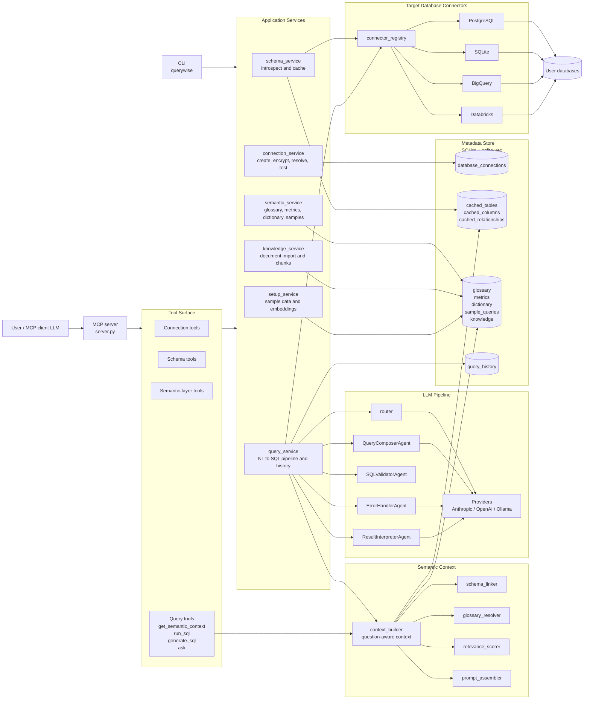
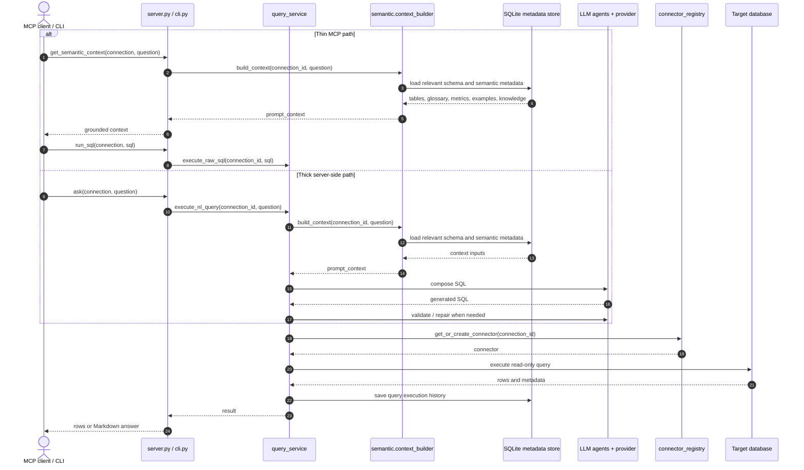
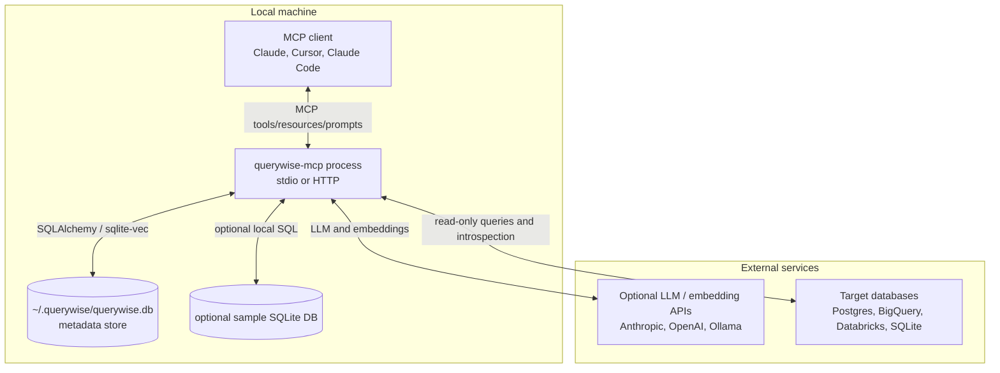

# QueryWise MCP Architecture

This document shows the high-level architecture for `querywise-mcp`: a headless
MCP server and CLI that ground natural-language database questions in cached
schema and semantic metadata, then execute read-only SQL through target
connectors.

## Component Diagram

## Main Query Sequence

## Deployment View

